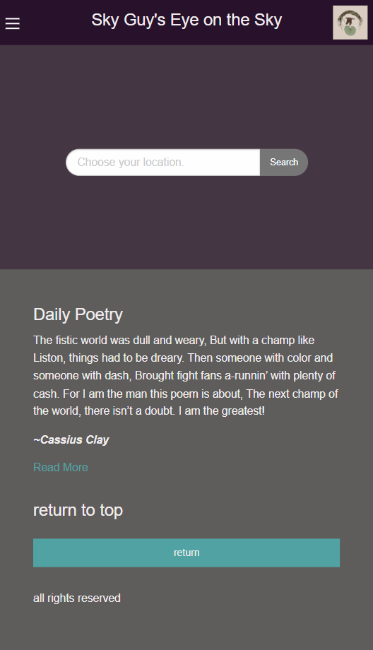
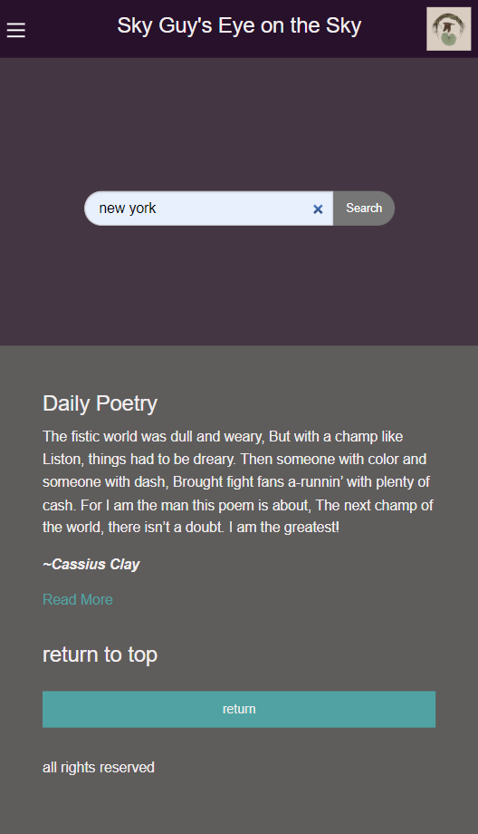
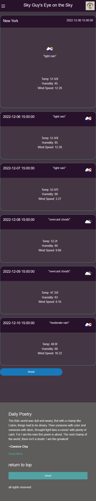

# 06-Five-Day-Weather-Forecast

## Description

Check your Five day weather forecast with Sky Guy's eye on the Sky.

Not the best but also not the worst way to check weather around the world. With this project you're able to search your location (unfortunately not by hitting enter you have to hit the search button with ya click) and get next five days forcast. Now I'm gonna be real with you. I realized that I should have been fetching the weather api to get the current weather data so big L on that one. 

It will however remind you of what city you looked up and return weather conditions, temp, humidity, windspeed, as well as a fun lil icon.
It also will loop through the next 5 days and give you a forcast for them as well.

If I had more time I could have also included an option to include history by appending your local storage history to the hamburger menu but unfortunately between this assignment and not wanting to let my group down I'd rather sacrifice my grade than theirs.

## Usage
### Step one.

Enter a City in the Input.
### Step two.

Hit search.

### Step three.

Your top card will be your most current information and was supposed to use the current api.
all following cards are your 5 day forcast.

Hitting reset reloads the page so you can search.

## Credits

Laurel Beyers https://get.foundation/building-blocks/blocks/responsive-blog-footer.html
Kevin Ball https://get.foundation/building-blocks/blocks/mobile-nav-bar.html

## License

refer to repo

---

## Features

Theres a nice poetry section I guess.
